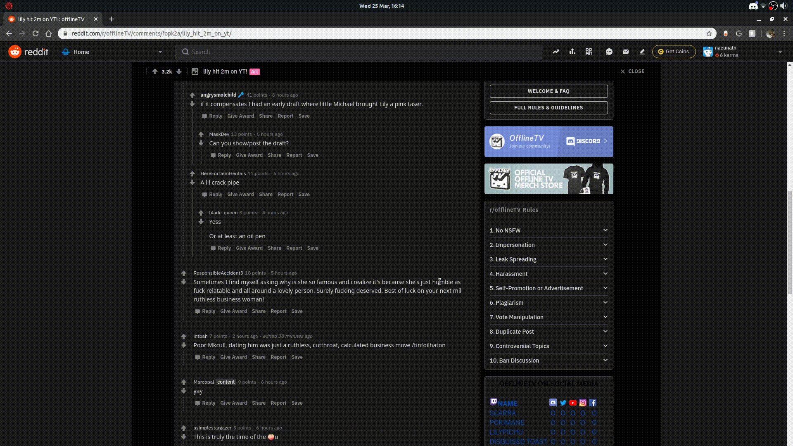

# dicto
basically defines words you highlight/select whatever you wanna call it

## The program
    
    git clone https://github.com/narasaka/dicto.git
    cd dicto
    ./dicto --version
    
### Usage
* To run dicto, simply type

      ./dicto
    
dicto runs in the background, so you can close your terminal now.

* Select the word you want, 

and press the hotkey <kbd>alt</kbd>+<kbd>T</kbd> (default)

* To stop dicto, type

      ./dicto --stop

### Dependencies
Dicto needs pyperclip, which also requires xclip (recommended) or xsel.
Install them! I dare you...

On Debian:

    sudo apt-get install xclip
        
On CentOS 7 / RHEL 7 / Fedora:

    sudo yum install xclip
    or
    dnf install xclip
        
On Arch:

    sudo pacman install xclip
  

        
### Donate to me
Don't. Ily.
