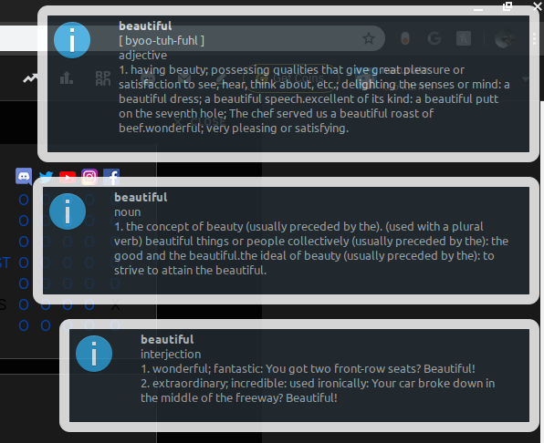

# dicto
looks up definitions of words that you highlight/select whatever you wanna call it

## The program
    
    git clone https://github.com/narasaka/dicto.git
    cd dicto
    pip3 install -r requirements.txt
    ./dicto --version
    
### Usage
* To run dicto, simply type

      ./dicto
    
dicto runs in the background, so you can close your terminal now.

* Select the word you want, 

and press the hotkey <kbd>alt</kbd>+<kbd>T</kbd> (default)

* To stop dicto, type

      ./dicto --stop

### Install
If everything works and you really want it,

    pip install dicto-pkg
    
Or alternatively (for Debian users),

    sudo dpkg -i dicto_v0.0.1.deb
    
Now you can run everything without the "./"

    dicto

### Dependencies
Dicto needs pyperclip, which also requires xclip (recommended) or xsel.
Install them! I dare you...

On Debian:

    sudo apt-get install xclip
        
On CentOS 7 / RHEL 7 / Fedora:

    sudo yum install xclip
    or
    dnf install xclip
        
On Arch:

    sudo pacman install xclip
  
### Troubleshooting
If dicto does not work, try

    git clone https://github.com/narasaka/dicto.git
    cd dicto
    pip3 install -r requirements.txt

If dicto outputs 2 or more of the same notification pop ups,

    dicto --stop
    dicto
    
### Donate to me
Don't. Ily.
